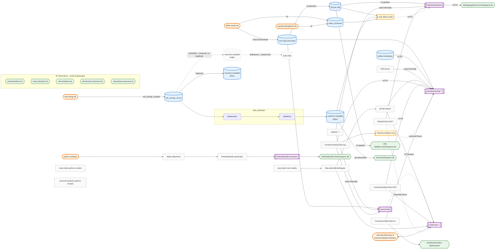

# Digitalisierte Marktkommunikation

Übersicht über ausgewählte Libraries und Tools mit denen Hochfrequenz eine echte Digitalisierung der Marktkommunikation in der deutschen Energiewirtschaft vorantreibt

## Hintergrund

Die Spezifikationen und Regeln, denen die Marktkommunikation der deutschen Energiewirtschaft unterliegt, sind nur schlecht bis gar nicht digitalisiert:

- Technische Dokumente liegen allgemein nur im PDF- oder Wordformat vor und sind nicht maschinenlesbar
- Message Implementation Guides (MIG) und Anwendungshandbücher (AHB) sind weder selbst- noch zueinander konsistent:
  - Feld- und Strukturnamen in MIG und AHB stimmen nicht überein
  - Es gab lange keinen direkten Weg, eine Zeile aus dem AHB im MIG wiederzufinden (z.b. über eindeutige IDs); Das ändert sich mit Oktober 2024🎉
- Vermeintlich boolsche Logik folgt keiner boolschen Logik
- Entscheidungsbäume (EBD) sind keine Bäume sondern nur Tabellen
- Änderungshistorien sind unvollständig und schwer verständlich
- u.v.m.

Hochfrequenz entwickelt Tools, die diese Mängel adressieren. Dieses Repository soll einen Überblick verschaffen.

## Übersicht

Die öffentlichen 🌍 Tools und Libraries unterliegen in der Regel der MIT- oder GPL-Lizenz und sind gut dokumentiert.
Bei Interesse an den nicht-öffentlichen/privaten 🔒 Repositories, bitte eine Nachricht an info (at) hochfrequenz.de oder [@JoschaMetze](https://github.com/JoschaMetze) schicken.

<!-- ORDER BY Name ASC -->

| Name & Link                                                                                                                 |     | Grundlage     | Zweck                                                                                                            | Tech Stack                                                                     |
| --------------------------------------------------------------------------------------------------------------------------- | --- | ------------- | ---------------------------------------------------------------------------------------------------------------- | ------------------------------------------------------------------------------ |
| [ahbicht](https://github.com/Hochfrequenz/ahbicht/) 🦅                                                                      | 🌍  | AHBs          | Parser und Evaluationsframework für Ausdrücke der Form `Muss [1] U ([2] O [3])[901] U [543]`                     | Python ([lark](https://github.com/lark-parser/lark))                           |
| [ahbicht-functions](https://github.com/Hochfrequenz/ahbicht-functions)                                                      | 🔒  | AHBs          | Serverless Backend, das AHBicht Features via REST verfügbar macht                                                | Python (Azure Functions)                                                       |
| [ahahnb](https://github.com/Hochfrequenz/ahbicht-functions-frontend/)                                   | 🔒  | AHBs          | Visualisierung von mit Ahbicht geparsten AHB-Expressions                                                                               | Typescript ([d3.js](https://d3js.org/))                                        |
| [ahbesser](https://github.com/Hochfrequenz/ahbesser/)                                   | 🌍  | AHBs          | Visualisierung von AHBs in einer zeitgemäßen Oberfläche (statt PDF)                                                                               | Angular                                         |
| [edi_energy_scraper](https://github.com/Hochfrequenz/edi_energy_scraper)                                                    | 🌍  | edi-energy.de | automatisierter Download von Dokumenten auf edi-energy.de                                                        | Python ([Beautiful Soup](https://www.crummy.com/software/BeautifulSoup/))      |
| [edi_energy_mirror](https://github.com/Hochfrequenz/edi_energy_mirror)                                                      | 🌍  | edi-energy.de | git-basierte, automatisierte Versionierung der Dokumente auf edi-energy.de                                       |                                                                                |
| [EDILibrary](https://github.com/Hochfrequenz/EDILibrary)                                                                    | 🌍  | AHBs & MIGs   | Parser und Template-Enginge für EDIFACT-Nachrichten                                                              | C#                                                                             |
| [EDILibraryHost](https://github.com/Hochfrequenz/EDILibraryHost)                                                            | 🔒  | AHBs & MIGs   | Serverless Backend zum Parsen, Erstellen und Versenden von EDIFACT-Nachrichten                                   | C# (Azure Functions)                                                           |
| [edifact-templates](https://github.com/Hochfrequenz/edifact-templates/)                                                      | 🔒  | AHBs & MIGs   | Daten-Repo: Gescrapte, maschinenlesbare AHBs, Templates für alle EDIFACT-Formate der deutschen Energiewirtschaft |                                                                                |
| [transformer.bee]()🐝                                                                                                       | 🔒  | AHBs & MIGs   | Bidirektionale, stabile und ein-eindeutige Konvertierung zwischen EDIFACT↔BO4E                                   | C# ([JUST.net](https://github.com/WorkMaze/JUST.net))                          |
| [transformer.bee Client](https://github.com/Hochfrequenz/TransformerBeeClient.NET)🐝                                                                                                       | 🌍  | AHBs & MIGs   | Eine .NET Client-Library für transformer.bee, um EDIFACT↔BO4E Konvertierung als SaaS zu nutzen                                   | C#                          |
| [transformer.bee Client](https://github.com/Hochfrequenz/TransformerBeeClient.py)🐝                                                                                                       | 🌍  | AHBs & MIGs   | Eine Python Client-Library für transformer.bee, um EDIFACT↔BO4E Konvertierung als SaaS zu nutzen                                   | Python                          |
| [EBD_amame](https://github.com/Hochfrequenz/ebdamame)                                                              | 🌍  | EBDs          | Scraping-Tool um docx-Dateien mit EBDs maschinenlesbar zu machen                                                 | Python ([python-docx](https://github.com/python-openxml/python-docx))          |
| [rebdhuhn](https://github.com/Hochfrequenz/rebdhuhn)                                                            | 🌍  | EBDs          | Core-Logik, die EBD-Tabellen in maschinenlesbare Graphen/Bäume umwandelt                                         | Python ([networkx](https://networkx.org/)) + [PlantUML](https://plantuml.com/) |
| [machine-readable_entscheidungsbaumdiagramme](https://github.com/Hochfrequenz/machine-readable_entscheidungsbaumdiagramme/) | 🌍  | EBDs          | Daten-Repo: Alle Entscheidungsbäume/Graphen, maschinenlesbar in verschiedenen Formaten (puml, dot, svg)          |                                                                                |
| 🆕 [entscheidungsbaumdiagramm](https://github.com/Hochfrequenz/entscheidungsbaumdiagramm)| 🌍  | Entscheidungsbaumdiagramme | Neues Frontend für `entscheidungsbaum.hochfrequenz.de`| TS/Svelte |
| [machine-readable_anwendungshandbuecher](https://github.com/Hochfrequenz/machine-readable_anwendungshandbuecher)            | 🌍  | AHBs          | Daten-Repo: Alle Anwendungshandbücher, maschinenlesbar in verschiedenen Formaten                                 | kohlrahbi             
| [machine-readable_message-implementation-guide](https://github.com/Hochfrequenz/machine-readable_message-implementation-guide)            | 🌍  | MIGs          | Daten-Repo: Alle MIGs, maschinenlesbar in verschiedenen Formaten                                 | migmose                                                                              |
| [kohlr_AHB_i](https://github.com/Hochfrequenz/kohlrahbi) 🥬                                                                   | 🌍  | AHBs          | Scraping-Library für PDF- und DOCX-Anwendungshandbücher                      | Python ([python-docx](https://github.com/python-openxml/python-docx))          |
| 🆕[AH_l_Batross](https://github.com/Hochfrequenz/ahlbatross) 🪿                                                                   | 🌍  | AHBs          | Diff-Library für (von kohlrahbi gescrapte) maschinenlesbare AHBs                      | Python           |
| [MIG_mose](https://github.com/Hochfrequenz/migmose)                                                                  | 🌍  | MIGs          | Scraping-Library für PDF- und DOCX-Message Implementation Guides                      | Python ([python-docx](https://github.com/python-openxml/python-docx))          |
| [fundamend](https://github.com/Hochfrequenz/xml-fundamend-python)| 🌍  | MIG & AHBs | Python Wrapper um das neue (2024) XML-basierte BDEW-Datenmodell für MIGs und AHBs | Python |
| 🆕 [malo-ident-python-models](https://github.com/Hochfrequenz/malo-ident-python-models)| 🌍  | MaLo Identifikation API | Autogenerierte Datenmodelle für die neue MaLo-ID API | Python |
| 🆕 [malo-ident-net-models](https://github.com/Hochfrequenz/malo-ident-net-models)| 🌍  | MaLo Identifikation API | Datenmodelle für die neue MaLo-ID API | C# |
| 🆕 [verzeichnisdienst-python-models](https://github.com/Hochfrequenz/verzeichnisdienst-python-models)| 🌍  | Verzeichnisdienst API | Autogenerierte Datenmodelle für die Verzeichnisdienst API | Python |
| [id-generator](https://github.com/Hochfrequenz/malo-id-generator)| 🌍  | MaLo / MeLo / NeLo / SR / TR | Autogenerierte zufällige IDs für Testzwecke | Go | 
| [mako.bee]() 🐝                                                                                                             | 🌍  | MaKo allg.    | Backend zur Orchestrierung von Marktkommunikationsprozessen in Micro-Service Landschaften                        | C# ([ELSA](https://github.com/elsa-workflows/elsa-core))                       |
| [fristenkalender-generator](https://github.com/Hochfrequenz/fristenkalender_generator) | 🌍 | MaKo allg.    | Berechnet Fristen in der deutschen Energiewirtschaft | Python (package) |
| [fristenkalender-functions](https://github.com/Hochfrequenz/fristenkalender-functions) | 🌍 | MaKo allg.    | API zur Berechnung von Fristen | Python (Azure Function) |
| [fristenkalender-frontend](https://github.com/Hochfrequenz/fristenkalender-frontend) | 🌍 | MaKo allg.    | Frontend der [Hochfrequenz Fristenkalenders](https://fristenkalender.hochfrequenz.de) | Svelte |
## Zusammenhänge

Das folgende Diagramm zeigt, wie die einzelnen Komponenten zusammenhängen.
**Knoten** sind Daten (Repositories, externe Quellen, Frontends). **Kanten** (Pfeile) sind Tools, die Daten verarbeiten oder transportieren.

Legende:
- 🟠 Abgerundet = Externe Datenquelle
- 🔵 Zylinder = Daten-Repository
- 🟣 Doppelrahmen = Service/Backend
- 🟢 Sechseck = Frontend
- ⬜ Rechteck = Library/Package
- 🟡 Flagge = MCP Server
- Gestrichelt = archiviert oder potenzielle Zukunft

> **Tipp:** Für eine Vollbildansicht den Mermaid-Code unten kopieren und in den [Mermaid Live Editor](https://mermaid.live) einfügen.

## Hochfrequenz

Die [Hochfrequenz Unternehmensberatung GmbH](https://www.hochfrequenz.de) hat ihren Sitz in Grünwald (nahe München), feste Büros in Berlin und Bremen und Home Offices in ganz
Deutschland. Wir leben Digitalisierung und entwickeln u.a. die oben vorgestellten Open Source-Lösungen für die deutsche Energiewirtschaft.
Auf [Kununu](https://www.kununu.com/de/hochfrequenz-unternehmensberatung1) sind wir unter den bestbewerteten Arbeitgebern der Branche. Wir freuen uns jederzeit über Bewerbungen
talentierter Entwickler\*innen und Fachexpert\*innen, z.B.
als [Full Stack Entwickler\*in](https://www.hochfrequenz.de/index.php/karriere/aktuelle-stellenausschreibungen/full-stack-entwickler).
